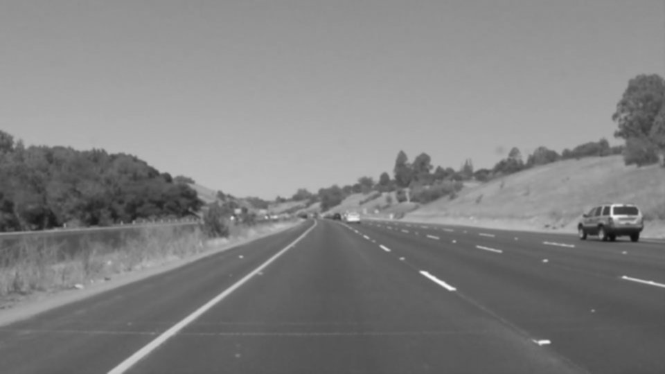
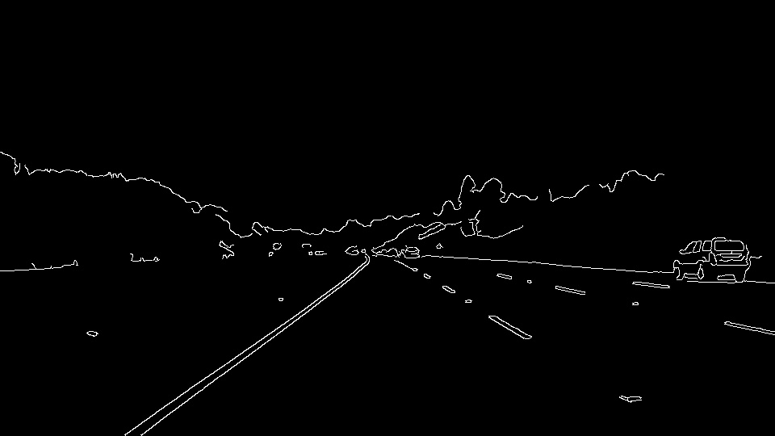
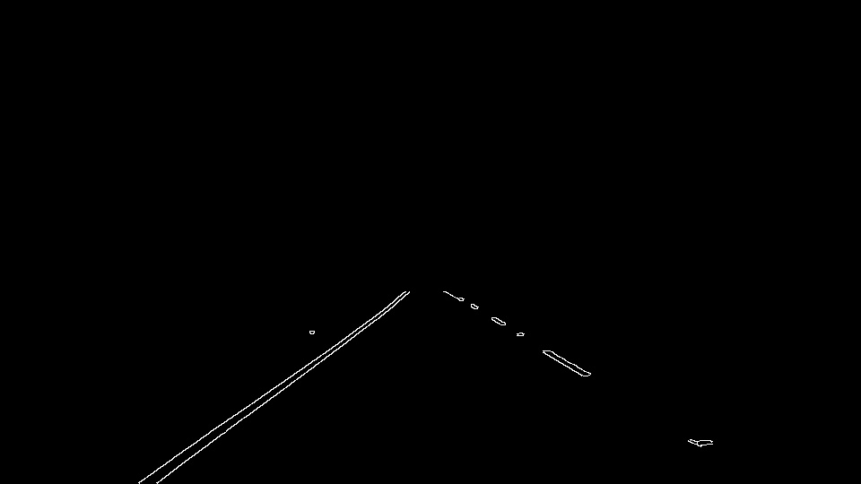
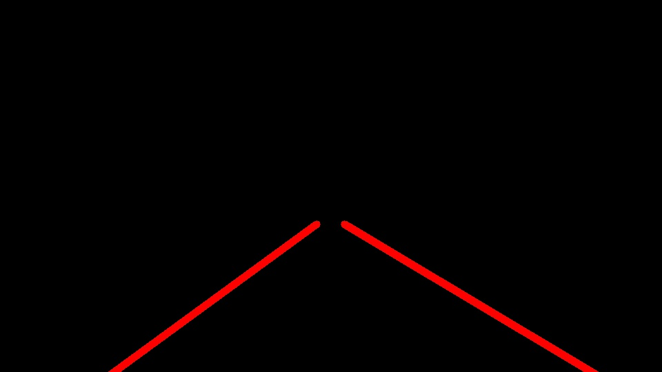
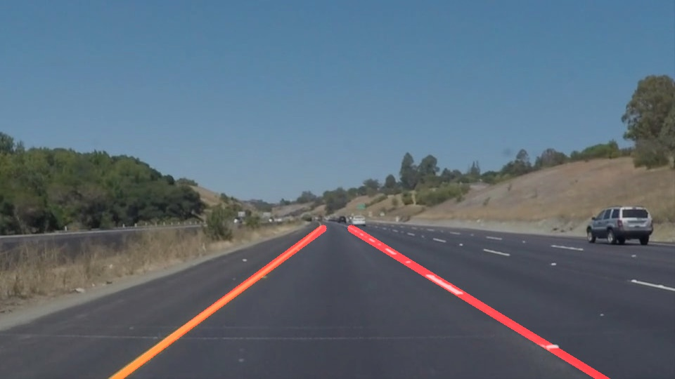

# **Finding Lane Lines on the Road** 

---

**Finding Lane Lines on the Road**

The goals / steps of this project are the following:
* Make a pipeline that finds lane lines on the road
* Reflect on your work in a written report

[//]: # (Image References)

---

### Reflection

### 1. Describe your pipeline. As part of the description, explain how you modified the draw_lines() function.

My pipeline consisted of 6 steps. The first two steps converted the images to grayscale and slightly blurred the images using a gaussian filter. The third step used the Canny algorithm for detecting edges in the blurred grayscale image.  After which, in the fourth step, I selected a region in the foreground of the image because I don't care about the sky and periphery.  In the fifth step, I used a Hough Transform and draw_lines help function to detect lines.  Finally, in the sixth step, I superimposed my lane line detection ontop of the original image.

In order to draw a single line on the left and right lanes, I modified the draw_lines() function to include 4 steps.  First, I cluster line segments by their slope direction (e.g. positive vs negative slope).  Second, I remove any line whose slope is within +/- 0.30 threshold because I am not interested in detecting horizontal-ish lines (e.g. 12 seconds @ solidWhiteRight.mp4).  Third, after grouping and filtering by slope, I calculate the average slope for each group's (left & right) remaining line segments.  Fourth, I choose the point (x,y) from each group (left & right) that has the minimum y and use the slope (m) to determine the bias (b) variable for each respective group.  Using the calculated (b) variable, I then extrapolate from the chosen point (x,y) to the bottom of the image.  This allows me to place a line from the top of my region to the bottom of the image for both the left and right lane groups.

If you'd like to include images to show how the pipeline works, here is how to include an image: 

##### Stage 1: Grayscale

##### Stage 2: Gaussian Filter

##### Stage 3: Canny Edge Detection

##### Stage 4: Region Selection

##### Stage 5: Hough Transform

##### Stage 6: Superimpose Hough Lines Onto Original Image

### 2. Identify potential shortcomings with your current pipeline

I think there are a lot of shortcomings with the current pipeline.  For one, the pipeline doesn't detect curved lane lines which might occur when the highway meanders.  

Also, the region selection portion of the pipeline always selects the same region instead of finding a region based on concepts such as foreground, background, etc.  Because of this fact, my current pipeline cannot detect lines accurately on the challenge.mp4 video.  Sure, I could retune all of my parameters, but that seems like the wrong approach if we're looking to improve things.

A major major shortcoming of my pipeline is that all of my paramters where hand-tuned.  That is, none of them were fitted to the data using more rigorous and reliable methods.

The model doesn't use past experiences in order to better predict future ones.  Having this would likely make the output a lot more robust to variations in data.

### 3. Suggest possible improvements to your pipeline

Our parameters should be tuned automatically, based on more reliable and rigorous methods.  This parameter tuning can include our region selection.

Furthermore, we should make changes so that we can fit curved roads.

Using a sequential model to predict future lines would allow our model to draw lane lines even when they aren't as clear.  It might even allow us to draw lane lines even when they don't exist!

